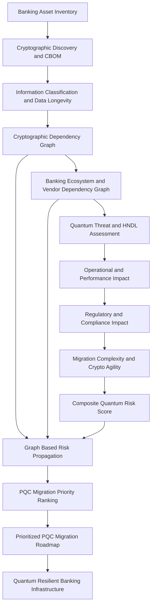

# PQC Banking Risk Framework Architecture

```mermaid
flowchart TD

    A[Banking Asset Inventory]

    B[Cryptographic Discovery and CBOM]

    C[Information Classification and Data Longevity]

    D[Cryptographic Dependency Graph]

    E[Banking Ecosystem and Vendor Dependency Graph]

    F[Quantum Threat and HNDL Assessment]

    G[Operational and Performance Impact]

    H[Regulatory and Compliance Impact]

    I[Migration Complexity and Crypto Agility]

    J[Composite Quantum Risk Score]

    K[Graph Based Risk Propagation]

    L[PQC Migration Priority Ranking]

    M[Prioritized PQC Migration Roadmap]

    N[Quantum Resilient Banking Infrastructure]


    A --> B
    B --> C
    C --> D
    D --> E
    E --> F
    F --> G
    G --> H
    H --> I
    I --> J

    D --> K
    E --> K
    J --> K

    K --> L
    L --> M
    M --> N
```